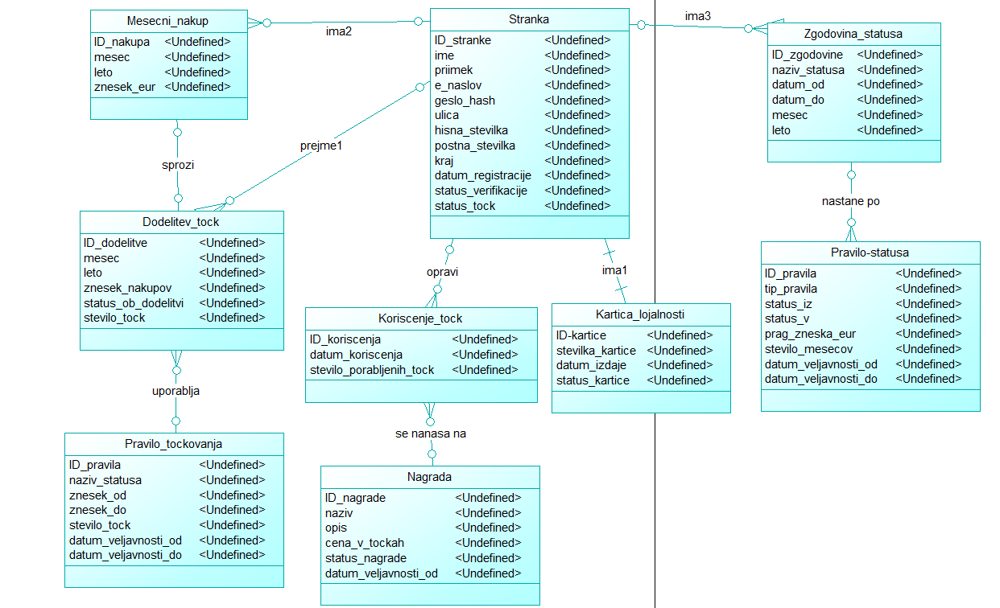

# Analiza in načrtovanje: Program lojalnosti Maestro

## 1. Podatkovni model



## 2. Funkcionalna dekompozicija

![Funkcionalna dekompozicija](https://vip.lavbic.net/plantuml/png/RLL1Rjim4Bpd5Jn6GUD6bD8ajoGe2XH5sW21UorM5cFJaac1ebb0V_0ZyXVdNzqbAPbgUpFisTdPcLtwlhTWxE-gFpkxOCz6hmtiMAktq2hTMycUGFJMQFprWkKBjkmCk7OBQYlOyT22wgq39XNRTzf0fUJxMoCtpC3ni5VQOTN5BwpBsJEowKuqp8YrH4POIQJ0GkTff7M2m06D-9Uk5LP12WT67rGZsFcNowiyI_2S_HH6liecuCIbWhxLg8oGF4KMxBEkHIkjS6n0bTX4h8aPxBuF-3B5bwZy_Kt6aHlqIgv4QX1LN6VZe7pcKEs7zlvqHh_ADZWIa3Zaajmp0PiOI8A2Wq5GaILL75F26N4snx34Gkindr9CWQBH0GlEpxaMVHkORb9KoPP6XEQw5zXwWuGrs4Ox3xxDVEfymPv4Buu7LAChz8vwdp-2NMregfNePHoVHa9njQwayxGZNMpAVRAFnl-ceDbtivvomCyKcq_awmk9oAycRiuUdDKxi788AIlfz1R7EuKnzU5XupH98GV6U3iZQcRryO3zICNEzvWMX7j_uxIQq1i81ksmBf3unFDYabMm7rK8An2pmU75w4fCd0MAYPoILTutESnAoEsxB2dWoPO6IAT7tKesUwyX3_aKYtWiSjo7ORgK8BBmkOXr6uPGMx-Hq5ZfKjiA7yy8770gYYSgZDINaHaoBs7Qki8VuLIhHEyJLMnOOmXEgXWuhTR_gMwoKIndtm01Uatr2l15gccsy3PD_NYYDUmIRKr40Vk8j-f985Bu9hTPKezzjC5xmqU08fwYoE-2iUM2FTGxgSRtfsz6XuFIaYuukVOUWMBNq_j7tygMz8ygOj_IUvnMHUWfN3mkeBR1bkanAXT_lownSjfIc6zfGdATaXGpadzSEfLndes3SlOTwa6R3mmKu5gIIdhKjCHjhwTTBsUf12NQnPndr5TPKi9d9UYYR99rIQhoj8eUkNQxhvGuwQ0p6TyJVsp3p0YEPtjsBrID_tT_0000)

## 3. Diagram prehajanja stanj med statusi


> **Opomba:** Ko stranki dodeljujemo točke zvestobe, ji najprej spremenimo status, v kolikor izpolnjuje pogoje in šele potem dodelimo ustrezno število točk.

## 4. Odločilna tabel za točkovanje

| Znesek nakupov v mesecu | Osnovni | Bronasti | Srebrni | Zlati |
| ----------------------- | ------- | -------- | ------- | ----- |
| **do 200 EUR**          |       5 |        0 |     7.5 |    10 |
| **200 EUR – 1000 EUR**  |      10 |        5 |      15 |    20 |
| **nad 1000 EUR**        |      20 |       10 |      30 |    40 |

## 5. Zaslonske maske

[Zaslonske maske narejene v orodju Figma](https://www.figma.com/make/qoBau0vFBUvsg8QTCeWloy/Loyalty-Program-Web-App-UI?t=EnjvQbXlX6Pe8hvX-0&preview-route=%2Fdashboard
)

## 6. API načrt

Vsi API-ji v tem poglavju opisujejo komunikacijo med našim sistemom in **zunanjimi sistemi**. Gre za integracijske točke, ki jih naš backend kliče kot odjemalec oziroma ki jih zunanji sistemi kličejo na našem backendu.

### 6.1 Integracija s Poslovnim IS Maestro

Poslovni IS Maestro je obstoječi sistem, ki hrani podatke o opravljenih nakupih strank v fizičnih in spletnih prodajalnah. Naš sistem ga kliče enkrat mesečno v sklopu batch procesa (F-09, F-10).

**`GET /external/poslovni-is/api/v1/nakupi`** – Pridobitev mesečnih nakupnih podatkov za vse stranke programa lojalnosti za pretekli mesec.
* **Query parametri:** `mesec=12&leto=2024`
* **Response:**
```json
[
  {
    "ID_stranke_IS": "MAE-00012345",
    "e_naslov": "janez.novak@maestro.si",
    "mesec": 12,
    "leto": 2024,
    "skupni_znesek_eur": 540.50
  },
  {
    "ID_stranke_IS": "MAE-00067890",
    "e_naslov": "ana.kovac@example.com",
    "mesec": 12,
    "leto": 2024,
    "skupni_znesek_eur": 1250.00
  }
]
```

### 6.2 Integracija z E-poštnim sistemom (SMTP / Mail API)

E-poštni sistem se uporablja na dveh mestih: ob registraciji stranke za verifikacijo e-naslova (F-02) ter ob ponastavitvi gesla (F-07). Naš backend komunicira s poštnim strežnikom prek standardnega SMTP-protokola ali REST API-ja ponudnika transakcijske pošte (npr. SendGrid, Mailgun).

**`POST /external/mail/api/v1/send`** – Pošiljanje verifikacijskega e-sporočila ob registraciji (F-02).
* **Payload:**
```json
{
  "from": "noreply@maestro.si",
  "to": "janez.novak@maestro.si",
  "subject": "Potrdite vaš e-naslov – Maestro program lojalnosti",
  "template_id": "verifikacija_emaila",
  "template_data": {
    "ime": "Janez",
    "verifikacijska_povezava": "https://lojalnost.maestro.si/verify?token=abc123xyz"
  }
}
```

* **Response:**
    
```json
{
  "status": "queued",
  "message_id": "msg-789456"
}
```

**`POST /external/mail/api/v1/send`** – Pošiljanje e-sporočila za ponastavitev gesla (F-07).
* **Payload:**
```json
{
  "from": "noreply@maestro.si",
  "to": "janez.novak@maestro.si",
  "subject": "Ponastavitev gesla – Maestro program lojalnosti",
  "template_id": "ponastavitev_gesla",
  "template_data": {
    "ime": "Janez",
    "povezava_za_ponastavitev": "https://lojalnost.maestro.si/reset-password?token=def456uvw"
  }
}
```
* **Response:**
```json
{
  "status": "queued",
  "message_id": "msg-789457"
}
```
* **Opomba:** Veljavnost žetonov za verifikacijo in ponastavitev gesla je časovno omejena (npr. 24 ur). Žetoni so shranjeni v interni bazi do uveljavitve ali preteka.

### 6.3 Integracija s Poštno / Logistično storitvijo

Po uspešni registraciji in verifikaciji stranke naš sistem posreduje zahtevo za tisk in dostavo kartice lojalnosti zunanji poštni oziroma logistični storitvi (F-05).

**`POST /external/posta/api/v1/narocila`** – Oddaja naročila za tisk in dostavo kartice lojalnosti (F-05).
* **Payload:**
```json
{
  "tip_posiljke": "kartica_lojalnosti",
  "prejemnik": {
    "ime": "Janez",
    "priimek": "Novak",
    "ulica": "Slovenska cesta",
    "hisna_stevilka": "1a",
    "postna_stevilka": "1000",
    "kraj": "Ljubljana",
    "drzava": "SI"
  },
  "podatki_kartice": {
    "ID_stranke": 12345,
    "nivo_lojalnosti": "osnovni"
  },
  "referenca": "KARTICA-MAE-12345"
}
```
   * **Response:**
```json
{
  "status": "sprejeto",
  "stevilka_sledenja": "SI123456789SI",
  "ocenjeni_datum_dostave": "2024-12-20"
}
```
* **Opomba:** Naročilo se odda takoj po uspešni verifikaciji e-naslova. Številka sledenja se shrani v interni bazi za morebitne kasnejše reklamacije.

### 6.4 Integracija s Sistemsko uro (Batch sprožilnik)

Mesečni batch proces (F-09) sproži sistemska ura. Gre za interno opravilo (cron job), ki se izvede enkrat mesečno po koncu obračunskega obdobja, brez zunanjega klica.

**Cron izraz:** `0 2 1 * *` *(vsak 1. v mesecu ob 02:00)*
**`POST /internal/batch/izracun-tock`** – Zažene sekvenco:
    1. Branje nakupnih podatkov iz Poslovnega IS (F-10)
    2. Posodobitev statusov strank (F-12, F-13)
    3. Dodelitev točk zvestobe po točkovniku (F-11)
* **Response:**
```json
{
  "status": "zakljuceno",
  "obdelanih_strank": 523147,
  "napak": 0,
  "cas_izvajanja_s": 184
}
```
* **Opomba:** Endpoint je dostopen izključno iz internega omrežja in ni izpostavljen javno. V primeru napake se sproži alarm na e-poštni naslov administratorjev.

## 7. Razredni diagram

### F-06 Prijava v portal

**Podrobnejši opis toka:**

| # | Osnovno besedilo | Podrobnejši opis |
|---|---|---|
| 3 | Uporabnik vnese e-naslov in geslo ter potrdi vnos. | Stran `PrijavaStran` zajame vrednosti iz obrazca in jih posreduje krmilniku `AvtentikacijaKrmilnik`. |
| 4 | Sistem preveri, ali e-naslov obstaja in ali se geslo ujema. | `AvtentikacijaKrmilnik` pokliče metodo `preveriPoverilnice()`, ki poizveduje po entiteti `Stranka`. Geslo se primerja z atributom `geslo_hash`. |
| 5 | Sistem ustvari JWT-žeton in vzpostavi sejo. | `AvtentikacijaKrmilnik` pokliče `ustvariJwtZeton()`, ki vrne podpisani žeton z `ID_stranke`, in `vzpostaviSejo()`, ki žeton shrani na odjemalcu. |
| S2 | Sistem prikaže splošno sporočilo o napaki. | `AvtentikacijaKrmilnik` vrne kodo napake, `PrijavaStran` pokliče `prikaziNapako()`. Napaka ne razkrije, ali je bil neveljaven e-naslov ali geslo. |

**Razredni diagram:**


**Diagram Zaporedja:**


### F-18 Pregled kataloga nagrad

**Podrobnejši opis toka:**

| # | Osnovno besedilo | Podrobnejši opis |
|---|---|---|
| 2 | Sistem pridobi seznam aktivnih nagrad. | `KatalogKrmilnik` pokliče metodo `pridobiAktivneNagrade()`, ki vrne vse zapise iz entitete `Nagrada` s `status_nagrade = 'aktivna'`. |
| 3 | Sistem prikaže katalog nagrad z nazivom in ceno v točkah. | `KatalogStran` iterira po vrnjeni listi objektov `Nagrada` in za vsako prikaže `naziv`, `opis` ter `cena_v_tockah`. |
| 4 | Sistem prikaže, ali ima uporabnik dovolj točk. | `KatalogKrmilnik` primerja `cena_v_tockah` vsake nagrade z atributom `status_tock` entitete `Stranka` in nastavi zastavico `jeDosegljiva`. |
| S2 | Ni aktivnih nagrad v katalogu. | `KatalogKrmilnik` vrne prazno listo, `KatalogStran` pokliče `prikaziPraznoStanje()`. |

**Razredni diagram:**


**Diagram Zaporedja:**


### F-20 Pregled statusov strank

**Podrobnejši opis toka:**

| # | Osnovno besedilo | Podrobnejši opis |
|---|---|---|
| 2 | Sistem prikaže filter za obdobje in status. | `StatusAdminStran` prikaži obrazec z datumskima poljema `datumOd` in `datumDo` ter spustnim menijem za `naziv_statusa`. |
| 3 | Administrator vnese parametre in potrdi iskanje. | `StatusAdminStran` posreduje filter objektu `StatusKrmilnik` prek metode `isciStatuse()`. |
| 4 | Sistem poizve po zgodovini statusov. | `StatusKrmilnik` pokliče `filtrirajPoObdobju()` na entiteti `Zgodovina_statusa`, ki vrne zapise, ki ustrezajo podanemu obdobju in statusu. |
| 5 | Sistem prikaže seznam strank s podatki o statusu. | `StatusAdminStran` prikaže kombinirane podatke iz `Stranka` (ime, priimek) in `Zgodovina_statusa` (naziv_statusa, datum_od, datum_do). |
| S2 | Ni zadetkov za izbrano obdobje. | `StatusKrmilnik` vrne prazno listo, `StatusAdminStran` pokliče `prikaziPraznoStanje()` in ohrani vrednosti filtrov. |

**Razredni diagram:**


**Diagram Zaporedja:**

![Diagram Zaporedja](https://vip.lavbic.net/plantuml/png/rLNDYkD64BxhAOhPYmtE4a8WiCmCE2mBWvECYI47OnXQxhAdBAbBwMvfYTuXJv972EnXsNslLBT-B8qzaElwOjdzVLLVVLrLSXcPKbbLWCC_ApHx_1MTKqTSvdGqi4VZqIPkG5bq9HlNetx6d3ykhUMFu6s5IQBsdYtSB7L1XfotIdxUW7AmJ5AkZ5RsBxZPUEKh5p4RWPYTkRqjy6Je_ZvYDyiDlDdZuR3_ATcpyPRpdhIo1UM6ia39sgCpRGLlqk_rZuT38hB9IwRjaJNNPDIJYtGLUF4G_S3RIhR38TMf7dXHLdOLVGOdTtVmw0pNXi1p1dTtIRA4x-wZ_dT0JOeMmQf6OuuPj0KGk1WxE4MryXZGIH8e0xEqbAc6Fb0kvi_cxQ6SBlkphvyG3l4KPbgY5ezw0V7XFI_02BVk2vvFDDK67GAdcjCJ0XdWSaydkTu-NCU2y5oojvfUI8l_FRXCcHEAjE5q5IfsUsghn2kosj3pKU4heQy2Unj21mMMh3gj-J4AhFvFaEqcsMw662TSPdA0vey-10SspnF30hPqVFRYWZK8ZIh9uGAazagk11jrufqfMIk3HTLvL0MFsfnLpDEN6aFy8Xr-Uz5Yzud6iRoknY0lDWGxJ8KSClaCOLOoFBn_Qhi2n_OacvvtHB-MHkU78dX-LKRNiPFavzm1ssXRDUiswwnBju2cauzJYmBuwoS2AWGZFIVVcNGq38FHJDkikw8diNjdsaVDWN1XJwlft95z1R9QcYeN3DUJ6bRNX-Ft3espdaUl38h3neJz5fNlp6nSKjzG8_dGgvVcvjB3P9M1p2yVSzGgt9_brB3p12eNfvgQ6-glDG7vZ0QlKSyUQzMYO7PWMoW_ZwZn18ciqgewFw7PgeU0dRK1QG5ZpjYU6EF2KbaUhOYfbqF2mIMCAo7e4hCCX_Ab3pAMNIWhRimEUqfMNco1i3B2pjlyy0v-8obFey-ubeUmzmJ0mvPviHOlLb2tUKORPvBocrW_atcK6soa_boQXg_jWkb5lOP-hV7N4IzrjWwCX_RplzjB-ytvTjxkp9fT9YyXuJGW8tvKN_usLD2kVRsZE20s1dVLsy__N9ydJckKfizP9fsV9HT98QZRIOWkoWI_R9p_0000)
